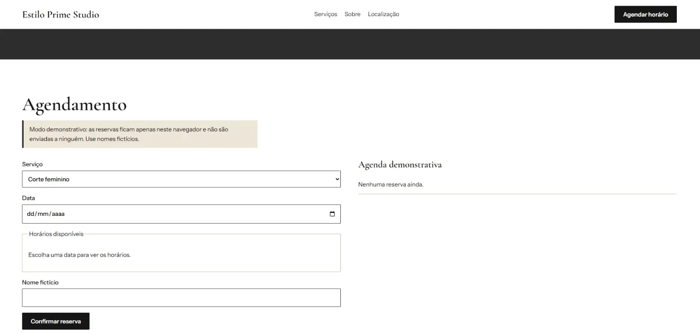

# Estilo Prime Studio

Landing page e agendamento demonstrativo para um salão de beleza fictício. Projeto de portfólio criado para mostrar como um site simples pode apresentar serviços, preços e durações, e organizar a agenda sem sobreposição de horários.

Este projeto é uma demonstração. O estúdio, os preços, o endereço, os horários e os agendamentos são fictícios. Não há clientes, depoimentos nem resultados reais.

**Demonstração online:** https://estilo-prime-studio-demo.netlify.app/


<p>
  
  
</p>

## O que o projeto faz

- Apresenta o estúdio, os serviços, o endereço e o horário de funcionamento (todos fictícios).
- Lista serviços com preço e duração, lidos de um único arquivo de dados.
- Permite escolher serviço, data e horário e confirmar uma reserva.
- Oferece somente horários que cabem na duração do serviço escolhido.
- Impede dois agendamentos no mesmo intervalo e revalida o horário no momento de gravar.
- Permite cancelar e remarcar pela agenda demonstrativa.
- Inclui uma conversa demonstrativa que conduz o mesmo fluxo de agendamento.

## Tecnologias

- HTML5 semântico
- CSS3, com layout responsivo e foco visível nos controles
- JavaScript moderno (módulos ES), sem bibliotecas externas
- Git e GitHub
- Netlify para publicação

## Como executar localmente

Os arquivos JavaScript usam módulos, então o projeto precisa ser aberto por um servidor local. A forma mais simples é a extensão Live Server do VS Code. Abrir o `index.html` direto do disco não funciona.

## Estrutura

```
estilo-prime-studio/
  index.html
  assets/
    css/styles.css
    images/
    js/
      main.js
      data/services.js
      modules/
        schedule.js
        storage.js
        chat.js
```

| Arquivo | Responsabilidade |
| --- | --- |
| `data/services.js` | Serviços, preços, durações e horário de funcionamento. Para alterar qualquer um deles, edite somente este arquivo. |
| `modules/schedule.js` | Cálculo de horários livres e detecção de conflitos. São funções que não mexem na tela nem no armazenamento. |
| `modules/storage.js` | Gravação, leitura e cancelamento de reservas. Hoje usa localStorage. |
| `modules/chat.js` | Fluxo da conversa demonstrativa, que usa as mesmas funções de agenda e armazenamento. |
| `main.js` | Liga a página aos módulos. |

## Como os conflitos são evitados

Cada reserva guarda o início e o término, calculado com a duração do serviço. Dois intervalos conflitam quando um começa antes de o outro terminar e o outro começa antes de o primeiro terminar. Terminar exatamente quando a próxima reserva começa é permitido.

Exemplo: com uma reserva das 10:00 às 11:30, um serviço de 60 minutos pode ser marcado às 9:00 (termina às 10:00) ou às 11:30, mas não às 10:30.

Antes de gravar, o sistema recalcula a disponibilidade e recusa a reserva se o horário já tiver sido ocupado.

## O que é simulado e o que não está integrado

Funcionalidades simuladas:

- As reservas ficam no localStorage do navegador. Elas não são compartilhadas entre pessoas, não são seguras e podem ser apagadas pelo usuário.
- A conversa usa respostas pré-programadas. Não há inteligência artificial real.
- Endereço, contato, preços, horários e nomes são fictícios.

Ainda não integrado:

- WhatsApp (Cloud API oficial) e webhooks.
- Modelo de linguagem com API.
- Agenda real (Google Calendar ou banco de dados).
- Servidor para proteger credenciais e controlar as operações de agenda.
- Armazenamento persistente com prevenção de reservas duplicadas em acessos simultâneos.

## Próxima fase (planejada, não implementada)

A integração real exigiria uma camada de servidor com variáveis de ambiente para as credenciais, um banco de dados que garanta que dois pedidos simultâneos não reservem o mesmo horário, e a definição de regras de autorização para consultar e alterar reservas. Antes de implementar, é preciso conferir custos, limites gratuitos e requisitos de cadastro de cada serviço. A troca do armazenamento local por um servidor fica concentrada em `modules/storage.js`.

## Privacidade

A demonstração usa somente dados fictícios e orienta o uso de nomes inventados. Nenhum dado é enviado a servidores. Em uma versão real, seria preciso coletar apenas o necessário para o agendamento, informar a finalidade e aplicar os cuidados da LGPD.

## Créditos das imagens

Fotografias do Unsplash, usadas conforme a licença do site:

- Corte feminino: foto de [Farhad Ibrahimzade] no Unsplash, [https://unsplash.com/pt-br/fotografias/uma-mulher-cortando-o-cabelo-de-outra-mulher-com-tesoura-V2HDOQTJh3o]
- Corte masculino: foto de [Gulom Nazarov] no Unsplash, [https://unsplash.com/pt-br/fotografias/barbeiro-aparando-cabelo-com-tesouras-de-ralo-DrG4V5skbMY]

## Autor

[Seu nome] | [LinkedIn ou GitHub]
